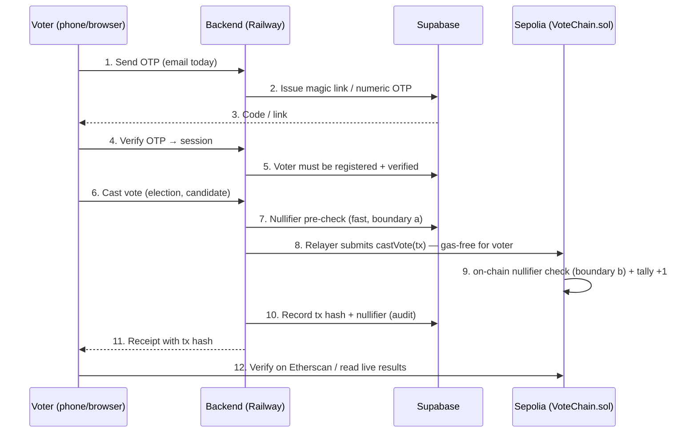

# VoteChain

**Trustless digital elections. One ballot, one signature, zero settlement games.**

> Transparent by construction — every tally lives on-chain and can be re-computed by anyone.
> Tamper-proof by design — votes are cryptographically sealed the moment they are cast.
> Trust-minimized by default — no wallet, no gas, no private ballot box in between.

VoteChain is a **live, end-to-end verifiable digital voting platform** for fair and
auditable elections. It is built for the real world: voters vote from a phone or browser
with only an OTP — **no cryptocurrency wallet, no gas fees, nothing to install** — while
election officials and the public can independently verify the arithmetic of the final
count against the immutable ledger behind it.

The current deployment is **LIVE on Sepolia testnet** and exercised end-to-end
(Frontend → Backend → Supabase → Sepolia) including a real cast vote with on-chain
confirmation and double-vote rejection.

---

## The problem this solves

Elections fail when the public cannot trust the counting. Manual tallies are slow to
release, hard to audit, and their arithmetic is invisible to the voter. Centralized
e-voting systems put the ballot box inside the vendor's server — voters must take the
result on faith.

**VoteChain removes the point of faith.** Every ballot passes through a public smart
contract that counts it exactly once. Anyone — a voter, an observer, a rival party — can
re-derive the announcement from the chain, so a "corrected" or "adjusted" tally is
detectable instantly. The ledger does the counting; humans stop being the mechanism and
become the auditors.

## What this build does (current capabilities)

- **Passwordless, wallet-less voting** — sign in with a one-time code (email OTP today;
  SMS/USSD on feature phones scoped in ADR-006). No MetaMask, no tokens, no gas. The
  backend *relayer* submits the on-chain transaction on the voter's behalf.
- **Tamper-evident ballots** — each vote is sealed by a deterministic nullifier and
  recorded on-chain with a public transaction hash. Results are read directly from the
  smart contract, not from a database someone could edit.
- **Double-vote prevention at two boundaries** — a Supabase nullifier table rejects
  replays fast (HTTP 409), and the on-chain nullifier mapping (already-voted check) is
  the authoritative backstop (Constitution Article II).
- **Admin election lifecycle** — create elections with candidates and voting windows,
  verify voters, close elections. Owner, relayer, and admin keys are strictly separated
  (ADR-003).
- **Public audit trail** — every vote produces a receipt with a tx hash the voter can
  verify on Sepolia Etherscan; the results endpoint re-reads the chain live.
- **Live stats** — registered voters / active elections / total votes on the landing page.

## Use cases

- **Kenyan general & county elections** — the stated case-in-point for the 2027
  Presidential cycle, and the natural prototype for any IEBC-scale auditability question.
- **Membership & institutional elections** — unions, cooperatives, clubs, DAOs, student
  bodies: anywhere a fair count over a known voter roll must be provable to the losers.
- **Observability showcases** — countries or commissions piloting technology want a
  *demonstrator*: "watch a ballot move from a phone to the public ledger in one minute."
- **Auditability prototypes** — regulators and civil society evaluating what "verifiable
  results" could look like without committing to a national rollout.

## Live status (2026-09-17)

| Layer | Service | Location |
|-------|---------|----------|
| Frontend | Vercel | https://votechain-ivory.vercel.app |
| Backend API | Railway | https://backend-production-64d05.up.railway.app |
| Smart contract | Sepolia testnet | [`0x672a1D837c5C0992218205b0E81492a07D7C5EB5`](https://sepolia.etherscan.io/address/0x672a1D837c5C0992218205b0E81492a07D7C5EB5) |
| Database + Auth | Supabase | project `gldfsjoikqydjxcarffr` |

Live proof (evidence: `docs/evidence/2026-09-17_layer5-live-end-to-end.md`): probe voter
OTP → register → admin verify → cast → Sepolia tx `0xb1d3f344…` (block 11724916, SUCCESS)
→ results show Candidate A: 1 → re-vote attempt rejected with **HTTP 409**.

## How a vote works



## Monorepo layout

```
votechain/
├── packages/
│   ├── contracts/      # VoteChain.sol, Hardhat deploy/seed/test scripts
│   ├── backend/        # Express + TS API: auth, elections, votes, admin, relayer
│   └── frontend/       # React 18 + Vite + Tailwind SPA
├── supabase/migrations/ # versioned SQL (schema + RLS)
├── docs/               # constitution, architecture, ADRs, sprints, evidence
├── .railway/           # Railway Infrastructure-as-Code (railway.ts)
└── vercel.json / coderabbit.yaml
```

## Quality gates (all green)

```bash
npm run test -w contracts      # 20 contract tests (hardhat)
npm run build -w backend       # tsc emits dist/
npm run test -w backend        # 8 vitest API/unit tests
npm run build -w frontend      # tsc && vite build
npm run lint -w frontend       # eslint --max-warnings 0
```

## Local development

```bash
npm install
# backend + frontend env per packages/*/.env.example
npm run dev                     # backend :3001, frontend :5173, against local Supabase
npm run test -w contracts       # local hardhat suite
```

## Deploying

- **Contract (Sepolia):** `cd packages/contracts && npx hardhat run scripts/deploy.ts --network sepolia`
  — writes `deployments/sepolia.json`; pass the address as `CONTRACT_ADDRESS` to the backend.
- **Backend:** Railway deploys from `.railway/railway.ts` (see `docs/evidence/2026-09-17_layer5-live-end-to-end.md`
  for the exact IaC sequence).
- **Frontend:** `vercel deploy --prod` from the repo (rootDirectory = `packages/frontend`).

Secrets never live in the repo: `.env` files are gitignored, and only non-secret placeholders
are documented in `.env.example`.

## Governance & status trackers

- **Constitution:** `docs/engineering/CONSTITUTION.md` (8 articles, vote-integrity invariants)
- **Architecture, gaps & P0s:** `docs/architecture.md`
- **Decision records:** `docs/adr/` (relayer pattern, two-boundary nullifier, key separation,
  deployment topology, mobile/OTP reachability)
- **Release notes:** `CHANGELOG.md`
- **Verification evidence:** `docs/evidence/` (each gate mapped to command + observed output)

## Roadmap (agenda)

- **ADR-006 in scope (next):** SMS/USSD feature-phone voting + mobile PWA feel, ~4–6 weeks,
  no core-architecture change.
- **Offline ballot packs:** new provisioning + reconciliation subsystem, ~3–4 months, needs
  its own design ADR — see `docs/adr/ADR-006-mobile-and-otp-reachability.md` for the full
  80/20 breakdown.
- **Etherscan source verification** of the deployed contract (needs an API key).
- **CodeRabbit PR review** once installed.

## Contributing

Open an issue or PR. Follow the repo conventions in `AGENTS.md` (signed commits,
evidence-with-work, change-scoped commits). Please read `docs/engineering/CONSTITUTION.md`
before touching the vote path.

---

**VoteChain — the count is public. The ballot is yours.**