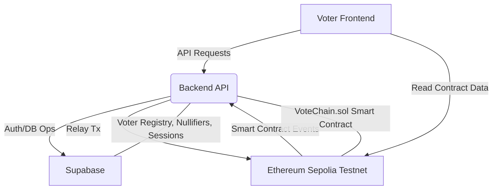
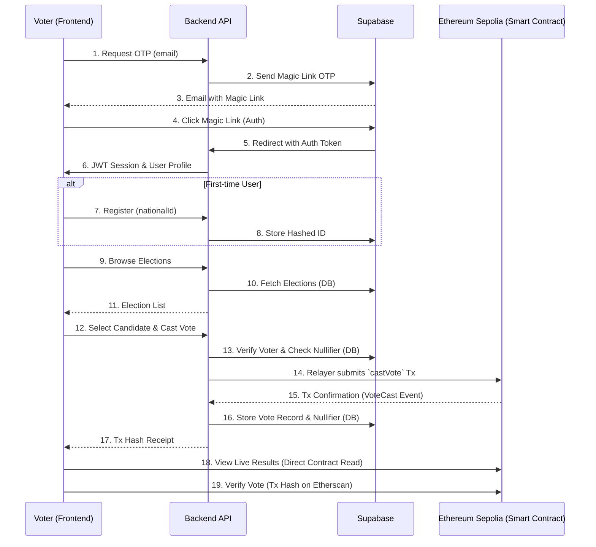

# VoteChain

**Tagline: Transparent. Tamper-proof. Trustless.**

VoteChain is a web-based blockchain voting system prototype designed for Kenya, aiming to bring unprecedented transparency and integrity to the electoral process. Leveraging the power of smart contracts on the Ethereum Sepolia testnet, VoteChain ensures that every vote is securely recorded, verifiable, and immune to tampering. The system allows administrators to create and manage elections, voters to register and cast their votes, and anyone to audit the election tally in real-time.

## Project Overview

This project provides a complete, production-quality MVP codebase for a blockchain-based online voting system. It's structured as a monorepo containing smart contracts, a backend API, and a frontend React application.

**Key Features:**
- **Admin Panel:** Create and manage elections, add candidates, and verify voters.
- **Voter Registration & Verification:** Secure identity verification for eligible voters.
- **Secure Voting:** Voters cast votes that are recorded on the Ethereum Sepolia testnet.
- **Real-time Auditing:** Publicly auditable vote tally directly from the blockchain.
- **Transaction Receipts:** Voters receive a transaction hash to verify their vote on Etherscan.
- **Gas-free Voting:** Backend relayer handles transaction costs for voters.

## Architecture Overview

VoteChain is built as a monorepo with three main packages:

- **`contracts`**: Contains the Solidity smart contracts for election logic and Hardhat for development and deployment.
- **`backend`**: An Express.js and TypeScript API that handles voter authentication, interaction with Supabase, and relays transactions to the blockchain.
- **`frontend`**: A React.js application built with Vite, TypeScript, and Tailwind CSS for the user interface.



## Tech Stack

- **Frontend:** React 18 + Vite + TypeScript
- **Styling:** Tailwind CSS + shadcn/ui components
- **Blockchain Interaction:** ethers.js v6
- **Smart Contract:** Solidity ^0.8.20
- **Development & Deployment:** Hardhat (local node + Sepolia testnet deployment)
- **Backend:** Node.js + Express + TypeScript
- **Database:** Supabase (PostgreSQL) — voter registry, nullifiers, sessions
- **Authentication:** Supabase Auth (email OTP — no passwords)
- **State Management:** Zustand
- **Forms:** React Hook Form + Zod validation
- **HTTP Client:** Axios
- **Testing:** Vitest (frontend), Hardhat test suite (contracts)
- **Wallet Relay:** Backend relayer pattern — voters do NOT need MetaMask

## Monorepo Structure

```
votechain/
├── packages/
│   ├── contracts/          # Hardhat project (Solidity smart contracts)
│   │   ├── contracts/
│   │   │   └── VoteChain.sol
│   │   ├── scripts/
│   │   │   └── deploy.ts
│   │   ├── test/
│   │   │   └── VoteChain.test.ts
│   │   ├── hardhat.config.ts
│   │   └── package.json
│   │
│   ├── backend/            # Express API
│   │   ├── src/
│   │   │   ├── routes/
│   │   │   │   ├── auth.ts
│   │   │   │   ├── elections.ts
│   │   │   │   ├── votes.ts
│   │   │   │   └── admin.ts
│   │   │   ├── middleware/
│   │   │   │   ├── authMiddleware.ts
│   │   │   │   └── errorHandler.ts
│   │   │   ├── services/
│   │   │   │   ├── relayerService.ts
│   │   │   │   ├── nullifierService.ts
│   │   │   │   └── supabaseService.ts
│   │   │   ├── config/
│   │   │   │   └── index.ts
│   │   │   └── index.ts
│   │   ├── .env.example
│   │   └── package.json
│   │
│   └── frontend/           # React + Vite
│       ├── src/
│       │   ├── pages/
│       │   │   ├── LandingPage.tsx
│   │   │   │   ├── LoginPage.tsx
│   │   │   │   ├── ElectionsPage.tsx
│   │   │   │   ├── BallotPage.tsx
│   │   │   │   ├── ResultsPage.tsx
│   │   │   │   ├── ReceiptPage.tsx
│   │   │   │   └── AdminPage.tsx
│       │   ├── components/
│       │   │   ├── ui/                   # shadcn/ui base components
│       │   │   ├── ElectionCard.tsx
│   │   │   │   ├── CandidateCard.tsx
│   │   │   │   ├── ResultsChart.tsx
│   │   │   │   ├── TxHashBadge.tsx
│   │   │   │   └── VoteConfirmModal.tsx
│       │   ├── store/
│       │   │   ├── authStore.ts
│       │   │   └── electionStore.ts
│       │   ├── hooks/
│       │   │   ├── useElection.ts
│       │   │   ├── useVote.ts
│       │   │   └── useResults.ts
│       │   ├── lib/
│       │   │   ├── supabase.ts
│       │   │   ├── api.ts
│       │   │   └── utils.ts
│       │   ├── types/
│       │   │   └── index.ts
│       │   └── App.tsx
│       ├── .env.example
│       └── package.json
│
├── package.json             # Root with workspaces
├── README.md
└── supabase_migrations.sql
```

## Prerequisites

Before you begin, ensure you have the following installed:

- **Node.js:** v18.x or higher
- **npm:** v9.x or higher (comes with Node.js)
- **Git:** For cloning the repository
- **Supabase Account:** For database, authentication, and storage (optional, but recommended for full functionality)
- **Infura/Alchemy Account:** For an Ethereum Sepolia RPC URL and an Etherscan API key for contract verification.

## Setup Instructions

1.  **Clone the repository:**
    ```bash
    git clone https://github.com/your-username/votechain.git
    cd votechain
    ```

2.  **Install dependencies:**
    ```bash
    npm install
    ```

3.  **Configure Environment Variables:**
    Create `.env` files in `packages/backend` and `packages/frontend` based on their respective `.env.example` files. Replace placeholder values with your actual credentials.

    **`packages/backend/.env`:**
    ```
    PORT=3001
    NODE_ENV=development
    SUPABASE_URL=your_supabase_url
    SUPABASE_SERVICE_ROLE_KEY=your_service_role_key
    RELAYER_PRIVATE_KEY=your_relayer_wallet_private_key
    SEPOLIA_RPC_URL=https://sepolia.infura.io/v3/your_key
    CONTRACT_ADDRESS=deployed_contract_address
    SERVER_SECRET=random_32_char_string_for_nullifier_generation
    ADMIN_EMAILS=admin@example.com,another@example.com
    CORS_ORIGIN=http://localhost:5173
    ```

    **`packages/frontend/.env`:**
    ```
    VITE_SUPABASE_URL=your_supabase_url
    VITE_SUPABASE_ANON_KEY=your_supabase_anon_key
    VITE_API_URL=http://localhost:3001
    VITE_CONTRACT_ADDRESS=deployed_contract_address
    VITE_SEPOLIA_EXPLORER=https://sepolia.etherscan.io
    ```

4.  **Supabase Setup:**
    - Create a new project on Supabase.
    - Go to `SQL Editor` and run the SQL commands from `supabase_migrations.sql` to set up your database schema and Row Level Security (RLS).
    - Obtain your `SUPABASE_URL`, `SUPABASE_ANON_KEY`, and `SUPABASE_SERVICE_ROLE_KEY` from your Supabase project settings (`Settings > API`).
    - Configure Supabase Auth for Email OTP.

5.  **Deploy Smart Contract:**
    First, compile the contracts:
    ```bash
    npm run compile -w contracts
    ```
    Then, deploy to Sepolia (ensure `RELAYER_PRIVATE_KEY` and `SEPOLIA_RPC_URL` are set in `packages/backend/.env` and `ETHERSCAN_API_KEY` in `packages/contracts/.env` if you want verification):
    ```bash
    npm run deploy:sepolia
    ```
    Update `CONTRACT_ADDRESS` in both `packages/backend/.env` and `packages/frontend/.env` with the deployed contract address.

6.  **Run the application:**
    Start the backend and frontend concurrently:
    ```bash
    npm run dev
    ```
    This will start the backend on `http://localhost:3001` and the frontend on `http://localhost:5173`.

## How the Voting Flow Works



## How to Verify a Vote on Etherscan

Each voter receives a transaction hash (`txHash`) upon successfully casting their vote. To verify your vote:

1.  Copy the `txHash` from your receipt page.
2.  Go to the Sepolia Etherscan website (configured in `VITE_SEPOLIA_EXPLORER`).
3.  Paste the `txHash` into the search bar and press Enter.
4.  You will see the details of your transaction, including the `VoteCast` event emitted by the `VoteChain` smart contract, confirming your vote.

## How to Run Tests

- **Smart Contracts:**
    ```bash
    npm run test -w contracts
    ```
- **Frontend:**
    ```bash
    npm run test -w frontend
    ```

## Deployment Guide for Sepolia Testnet

1.  Ensure your `packages/backend/.env` has `RELAYER_PRIVATE_KEY` and `SEPOLIA_RPC_URL` configured.
2.  Ensure your `packages/contracts/.env` has `ETHERSCAN_API_KEY` if you wish to verify your contract on Etherscan.
3.  Deploy the smart contract:
    ```bash
    npm run deploy:sepolia
    ```
    Update the `CONTRACT_ADDRESS` in both backend and frontend `.env` files with the newly deployed contract address.
4.  Build the frontend for production:
    ```bash
    npm run build -w frontend
    ```
5.  The `dist` folder in `packages/frontend` will contain the production-ready static assets. These can be deployed to any static site hosting service (e.g., Vercel, Netlify, Cloudflare Pages).
6.  The `packages/backend` can be deployed to a Node.js server environment (e.g., Vercel, Render, AWS EC2, DigitalOcean Droplet).

## Contributing

Contributions are welcome! Please follow these steps:

1.  Fork the repository.
2.  Create a new branch (`git checkout -b feature/your-feature-name`).
3.  Make your changes.
4.  Commit your changes (`git commit -m 'Add new feature'`).
5.  Push to the branch (`git push origin feature/your-feature-name`).
6.  Open a Pull Request.

## License

This project is licensed under the MIT License - see the [LICENSE](LICENSE) file for details.
