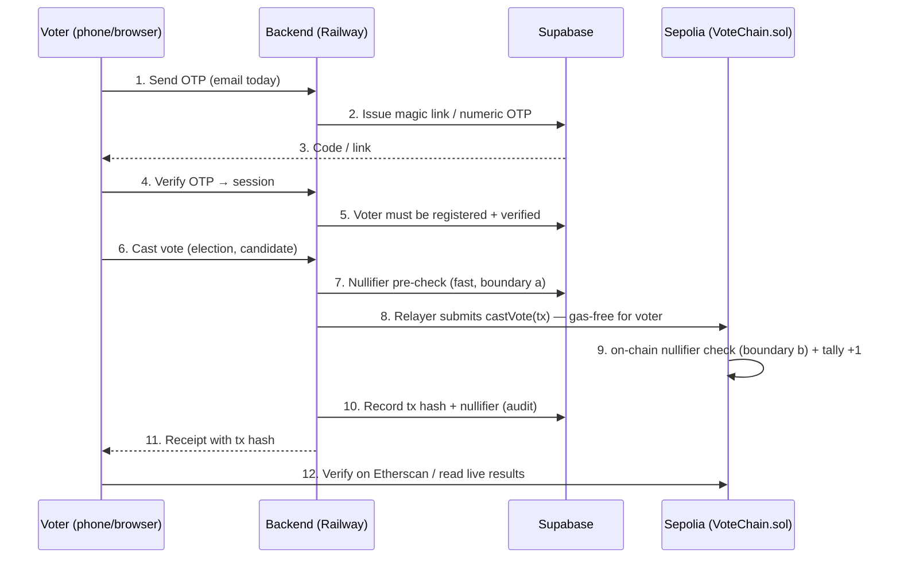

# VoteChain

**Trustless digital elections. One ballot, one signature, zero settlement games.**

> Transparent by construction — every tally lives on-chain and can be re-computed by anyone.
> Tamper-proof by design — votes are cryptographically sealed the moment they are cast.
> Trust-minimized by default — no wallet, no gas, no private ballot box in between.

VoteChain is a **live, end-to-end verifiable digital voting platform** for fair and
auditable elections. It is built for the real world: voters vote from a phone or browser
with only an OTP — **no cryptocurrency wallet, no gas fees, nothing to install** — while
election officials and the public can independently verify the arithmetic of the final
count against the immutable ledger behind it.

The current deployment is **LIVE on Sepolia testnet** and exercised end-to-end
(Frontend → Backend → Supabase → Sepolia) including a real cast vote with on-chain
confirmation and double-vote rejection.

---

## The problem this solves

Elections fail when the public cannot trust the counting. Manual tallies are slow to
release, hard to audit, and their arithmetic is invisible to the voter. Centralized
e-voting systems put the ballot box inside the vendor's server — voters must take the
result on faith.

**VoteChain removes the point of faith.** Every ballot passes through a public smart
contract that counts it exactly once. Anyone — a voter, an observer, a rival party — can
re-derive the announcement from the chain, so a "corrected" or "adjusted" tally is
detectable instantly. The ledger does the counting; humans stop being the mechanism and
become the auditors.

## What this build does (current capabilities)

- **Passwordless, wallet-less voting** — sign in with a one-time code (email OTP today;
  the dialer SMS/USSD channel in ADR-009 now covers feature phones, pending carrier gateway
  credits). No MetaMask, no tokens, no gas. The backend *relayer* submits the on-chain
  transaction on the voter's behalf.
- **Tamper-evident ballots** — each vote is sealed by a deterministic nullifier and
  recorded on-chain with a public transaction hash. Results are read directly from the
  smart contract, not from a database someone could edit.
- **Double-vote prevention at two boundaries** — a Supabase nullifier table rejects
  replays fast (HTTP 409), and the on-chain nullifier mapping (already-voted check) is
  the authoritative backstop (Constitution Article II).
- **Admin election lifecycle** — create elections with candidates and voting windows,
  verify voters, close elections. Owner, relayer, and admin keys are strictly separated
  (ADR-003).
- **Public audit trail** — every vote produces a receipt with a tx hash the voter can
  verify on Sepolia Etherscan; the results endpoint re-reads the chain live.
- **Live stats** — registered voters / active elections / total votes on the landing page.

## Use cases

- **Kenyan general & county elections** — the stated case-in-point for the 2027
  Presidential cycle, and the natural prototype for any IEBC-scale auditability question.
- **Membership & institutional elections** — unions, cooperatives, clubs, DAOs, student
  bodies: anywhere a fair count over a known voter roll must be provable to the losers.
- **Observability showcases** — countries or commissions piloting technology want a
  *demonstrator*: "watch a ballot move from a phone to the public ledger in one minute."
- **Auditability prototypes** — regulators and civil society evaluating what "verifiable
  results" could look like without committing to a national rollout.

## Live status (2026-09-17)

| Layer | Service | Location |
|-------|---------|----------|
| Frontend | Vercel | https://votechain-ivory.vercel.app |
| Backend API | Railway | https://backend-production-64d05.up.railway.app |
| Smart contract | Sepolia testnet | [`0x672a1D837c5C0992218205b0E81492a07D7C5EB5`](https://sepolia.etherscan.io/address/0x672a1D837c5C0992218205b0E81492a07D7C5EB5) |
| Database + Auth | Supabase | project `gldfsjoikqydjxcarffr` |

Live proof (evidence: `docs/evidence/2026-09-17_layer5-live-end-to-end.md`): probe voter
OTP → register → admin verify → cast → Sepolia tx `0xb1d3f344…` (block 11724916, SUCCESS)
→ results show Candidate A: 1 → re-vote attempt rejected with **HTTP 409**.

---

## Capabilities & strengths (latest — Sprint 5, 2026-09-19)

Everything below is live, SSH-signed, and backed by reproducible evidence in
`docs/evidence/` (each claim maps to a gate that produced the observed output).

### 1. Feature-phone dialer voting — vote by text, no browser, no data (ADR-009)

A voter with a basic phone and no internet can vote through the dialer:

- **Bind a phone to a verified voter** (never an anonymous identity). The number maps
  to the verified `voters` row; unbound numbers are refused with an explicit reply.
- **One-time 6-digit PIN.** `POST /api/dialer/codes` issues a PIN bound to
  `{voter, election, phone}`, expiring with the election; only its SHA-256 digest is
  stored, one active per (voter, election). It is the dialer analogue of the offline
  voucher. The PIN must sit inside the vote command, so a bare `VOTE` is never a vote
  before authentication.
- **Text the command.** `VOTE <electionCode> <candidateId> <pin>` is received at the
  carrier webhook (`POST /api/dialer/sms`) and runs the **exact same**
  `voteService.castVote` as online/offline — nullifier → relayer → Sepolia → receipt.
  No second counting authority.
- **Receipt by code.** Each vote gets a short code (`V` + first 12 hex of the tx hash);
  `RECEIPT <code>` or `GET /api/dialer/receipts/:code` re-verifies it with no voter
  identity exposed.
- **No silent drops.** Every inbound command is audited to `sms_intake_log` with an
  explicit outcome (`voted`, `duplicate`, `expired`, `invalid_pin`, …).
- **Gateway seam.** `SmsGateway` + `SimulatedSmsGateway` default; Twilio / Africa's
  Talking are explicit stubs until a carrier subscription exists. We never claim SMS
  delivery we cannot provide.

> Live drill (deployed backend, 2026-09-19): `VOTE 1 1 246810` → `voted`, receipt
> `V2E6A8BBA1009`, Sepolia tx `0x2e6a8bba…8295` (block **11737079**,
> `VoteCast(uint256,uint256,bytes32)`); PIN rotated and replayed → `duplicate`,
> no second transaction.
> Evidence: `docs/evidence/2026-09-19_dialer-sms-live-drill.md`.

### 2. Fully offline ballot capture — votes survive zero connectivity (ADR-008)

A voter does **not** need a signal to vote. The PWA is a real polling station in
the phone:

- **Signed ballot provisioning (online, one tap).** While connected, the app asks
  the server for a *signed voucher* — a cryptographically bound,
  per-election/per-voter ballot that carries the sealed candidate options and an
  expiry. The server records it `issued` and nothing about your choice is sent yet.
- **Airplane-mode capture.** With the device fully offline (`navigator.onLine =
  false`), the voter picks a candidate and the vote is written to a **private,
  signed vault on the device** (`localStorage` `vc_offline_vouchers` /
  `vc_offline_ballots`). The ballot never leaves the phone while offline — there is
  no "callback to the server later", no private ballot box in between.
- **Optional / guaranteed capture.** The same signed voucher is re-usable if the
  vault is wiped; the app re-resolves it, so a first capture never needs a
  pre-existing ballot or a second trip online.
- **Zero-trust reconnect.** The moment the device comes back online, a global
  `OfflineSync` (mounted once at app level, not just on the one page) **auto-submits**
  the captured ballot through the *exact same server path* as an online vote —
  signed voucher → server `consumed` → relayer → Sepolia. The vault flips to
  `submitted` with a real `txHash`; the server voucher flips to `consumed` with a
  `consumed_at`. Duplicate submissions are rejected (`409`), not silently dropped
  (ADR-008 / ADR-001 Articles I.4, I.6).
- **Provable after the fact.** After reconnect the vote is on-chain: `VotedCast`
  event with the voter's nullifier signature, broadcast by the relayer, receipt
  `status 0x1`, in the same block as any online vote.

> On-device PASS (physical Android phone, 2026-09-18):
> offline cold boot → signed ballot → airplane ON → capture → reconnect →
> auto-submit → voucher consumed → VotedCast on Sepolia (block 11731807).
> Evidence: `docs/evidence/2026-09-18_sprint4-offline-device-pass.md`.

### 3. Double-vote resistance at two boundaries (ADR-003, Article II)

- **Fast boundary:** a Supabase `nullifier` table rejects replays with HTTP 409 the
  moment a second attempt arrives — no relayer gas is spent on duplicates.
- **Authority boundary:** the chain's own `alreadyVoted` (nullifier mapping) is the
  final backstop — even a forged relay of the same nullifier cannot mint a second
  count. The offline flow keeps the same invariant: one voucher, one `consumed`, one
  nullifier, one vote on-chain.

### 4. No wallet, no gas, no install — but real on-chain receipts

Voters use plain OTP (email today; the dialer SMS/USSD channel is ADR-009) and the *relayer*
pays gas. Voters literally cannot lose funds or keys; the platform keeps the
security properties of a self-custody vote (signed nullifier, on-chain log) without
the self-custody UX tax.
- Each vote returns a receipt with the on-chain `txHash` a voter can verify on
  Etherscan/Sepolia (block + `VotedCast`).
- Every result is recomputable by anyone from the contract — no database edit can
  change the public count (Article I.4/I.5).
- Live stats, results, and the audit trail all come from the source of truth.

### 4. Physical-device-first engineering (ADR-006 / ADR-007)

- Installed PWA on a **real Android phone** (WebAPK, standalone, offline-capable) —
  the target device, not a desktop emulator.
- Mobile-first touch UI (44px targets, safe-area, bottom nav), no white screens, no
  silent drops: reconnect fail-fast, in-flight double-submit guard, "stale data"
  labels when offline.
- Backend on Railway, contract on Sepolia, DB + auth in Supabase — all three gates
  verified live end-to-end (contract 20/20, backend 8/8 + build, frontend 21/21 +
  build + lint 0 warnings).

## How a vote works



## Monorepo layout

```
votechain/
├── packages/
│   ├── contracts/      # VoteChain.sol, Hardhat deploy/seed/test scripts
│   ├── backend/        # Express + TS API: auth, elections, votes, admin, relayer
│   └── frontend/       # React 18 + Vite + Tailwind SPA
├── supabase/migrations/ # versioned SQL (schema + RLS)
├── docs/               # constitution, architecture, ADRs, sprints, evidence
├── .railway/           # Railway Infrastructure-as-Code (railway.ts)
└── vercel.json / coderabbit.yaml
```

## Quality gates (all green)

```bash
npm run test -w contracts      # 20 contract tests (hardhat)
npm run build -w backend       # tsc emits dist/
npm run test -w backend        # 8 vitest API/unit tests
npm run build -w frontend      # tsc && vite build
npm run lint -w frontend       # eslint --max-warnings 0
```

## Local development

```bash
npm install
# backend + frontend env per packages/*/.env.example
npm run dev                     # backend :3001, frontend :5173, against local Supabase
npm run test -w contracts       # local hardhat suite
```

## Deploying

- **Contract (Sepolia):** `cd packages/contracts && npx hardhat run scripts/deploy.ts --network sepolia`
  — writes `deployments/sepolia.json`; pass the address as `CONTRACT_ADDRESS` to the backend.
- **Backend:** Railway deploys from `.railway/railway.ts` (see `docs/evidence/2026-09-17_layer5-live-end-to-end.md`
  for the exact IaC sequence).
- **Frontend:** `vercel deploy --prod` from the repo (rootDirectory = `packages/frontend`).

Secrets never live in the repo: `.env` files are gitignored, and only non-secret placeholders
are documented in `.env.example`.

## Governance & status trackers

- **Constitution:** `docs/engineering/CONSTITUTION.md` (8 articles, vote-integrity invariants)
- **Architecture, gaps & P0s:** `docs/architecture.md`
- **Decision records:** `docs/adr/` (relayer pattern, two-boundary nullifier, key separation,
  deployment topology, mobile/OTP reachability)
- **Release notes:** `CHANGELOG.md`
- **Verification evidence:** `docs/evidence/` (each gate mapped to command + observed output)

## Roadmap (agenda)

- **Feature-phone / dialer reach (ADR-009) — shipped.** Intake, one-time PIN, audit log and
  receipt codes are live and proven end-to-end. The remaining step is **procurement**: a carrier
  gateway subscription + credits (Twilio / Africa's Talking) turns on the physical SMS/USSD radio
  hop — no core-architecture change.
- **Offline ballot packs:** provisioning + reconciliation subsystem shipped (Sprint 4, ADR-008);
  see `docs/adr/ADR-006-mobile-and-otp-reachability.md` for the original 80/20 breakdown.
- **Etherscan source verification** of the deployed contract (needs an API key).
- **CodeRabbit PR review** once installed.

## Contributing

Open an issue or PR. Follow the repo conventions in `AGENTS.md` (signed commits,
evidence-with-work, change-scoped commits). Please read `docs/engineering/CONSTITUTION.md`
before touching the vote path.

---

**VoteChain — the count is public. The ballot is yours.**